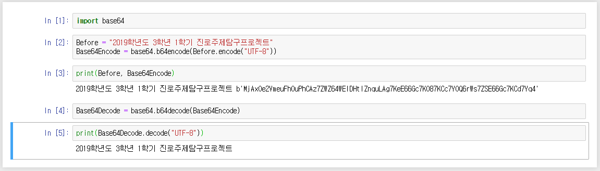

# 5회차

> BASE64, SHA1, SHA256, MD5 암호화 해보기

## 참가자


## 활동내용

프로그래밍 언어 `파이썬`에는 수많은 모듈이 있는데, 물론 암호화를 위한 모듈도 존재한다. 이번 프로젝트에서 알아보는 암호화 방식 총 4가지는 모두 파이썬의 내장 모듈을 통해서 간편하게 수행해볼 수 있다. 간편한 코드 작성을 위해 주피터 노트북으로 대체한다.

암호화방식 | 모듈이름
:--------:|:-------:
base64 | base64
sha1 | hashlib
sha256 | hashlib
md5 | hashlib

### BASE64 ([Notebook](jupyter%20notebook/5일차-base64.ipynb))

base64는 언어 코드에 구애받지 않는 64개의 기본 ASCII 코드 만으로 이루어진 문자열로 바꾸는 인코딩 방식을 가리키는 개념이다. 컴퓨터의 텍스트 표시 시스템은 사용하고 있는 언어 별로 매우 다양한 인코딩방식을 갖고 있기 때문에, 전자메일을 주고받을 때처럼 서로 다른 인코딩 방식을 사용할 때가 생긴다. 이럴 때, 해당 인코딩 방식을 지원하지 않아 내용을 파싱할 수 없는 경우, 메일 시스템에 오류가 발생할 수 있는데, 이를 막기 위해 고안된 시스템으로 알려져 있다. base64의 64는 2의 6승으로, 2의 진법에 기반한 인코딩 방식 중 가장 큰 진법이다. 즉, ASCII 문자 중 64개를 이용하여 문자열을 나타내는 것이다.

`Input`
```py
"2019학년도 3학년 12학기 진로주제탐구프로젝트"
```

위의 문자열을 base64로 인코드 하기 위해서는 일단 바이트코드로 바꾸어주어야하는데, 간단히 한글 인코딩 방식 중 하나인 UTF-8로 인코드하면 된다. 

`Output (UTF-8)`
```py
b'2019\xed\x95\x99\xeb\x85\x84\xeb\x8f\x84 3\xed\x95\x99\xeb\x85\x84 12\xed\x95\x99\xea\xb8\xb0 \xec\xa7\x84\xeb\xa1\x9c\xec\xa3\xbc\xec\xa0\x9c\xed\x83\x90\xea\xb5\xac\xed\x94\x84\xeb\xa1\x9c\xec\xa0\x9d\xed\x8a\xb8'
```

이후에 base64.b64encode 함수를 이용하여 인코드하면 된다.

`Output (UTF-8, Base64)`
```py
b'MjAxOe2VmeuFhOuPhCAz7ZWZ64WEIDEy7ZWZ6riwIOynhOuhnOyjvOygnO2DkOq1rO2UhOuhnOygne2KuA=='
```




## 참고자료
[위키피디아 "base64"](https://ko.wikipedia.org/wiki/%EB%B2%A0%EC%9D%B4%EC%8A%A464#cite_ref-2)