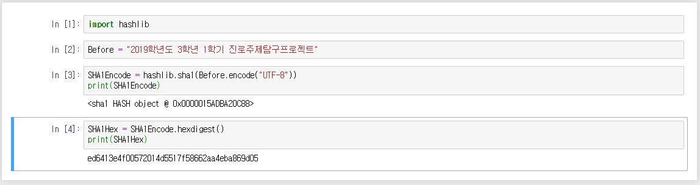
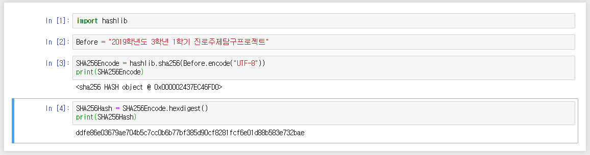
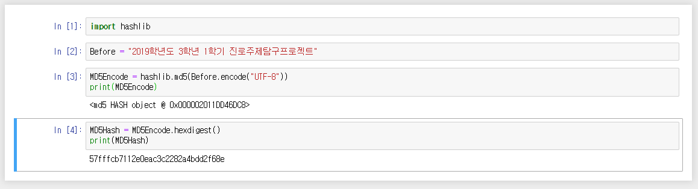

# 5회차

> BASE64, SHA1, SHA256, MD5 암호화 해보기

## 참가자


## 활동내용

프로그래밍 언어 `파이썬`에는 수많은 모듈이 있는데, 물론 암호화를 위한 모듈도 존재한다. 이번 프로젝트에서 알아보는 암호화 방식 총 4가지는 모두 파이썬의 내장 모듈을 통해서 간편하게 수행해볼 수 있다. 간편한 코드 작성을 위해 주피터 노트북으로 대체한다.

암호화방식 | 모듈이름
:--------:|:-------:
base64 | base64
sha1 | hashlib
sha256 | hashlib
md5 | hashlib

### BASE64 ([Notebook](jupyter%20notebook/5일차-base64.ipynb))

base64는 언어 코드에 구애받지 않는 64개의 기본 ASCII 코드 만으로 이루어진 문자열로 바꾸는 인코딩 방식을 가리키는 개념이다. 컴퓨터의 텍스트 표시 시스템은 사용하고 있는 언어 별로 매우 다양한 인코딩방식을 갖고 있기 때문에, 전자메일을 주고받을 때처럼 서로 다른 인코딩 방식을 사용할 때가 생긴다. 이럴 때, 해당 인코딩 방식을 지원하지 않아 내용을 파싱할 수 없는 경우, 메일 시스템에 오류가 발생할 수 있는데, 이를 막기 위해 고안된 시스템으로 알려져 있다. base64의 64는 2의 6승으로, 2의 진법에 기반한 인코딩 방식 중 가장 큰 진법이다. 즉, ASCII 문자 중 64개를 이용하여 문자열을 나타내는 것이다.

`Input`
```py
"2019학년도 3학년 1학기 진로주제탐구프로젝트"
```

위의 문자열을 base64로 인코드 하기 위해서는 일단 바이트코드로 바꾸어주어야하는데, 간단히 한글 인코딩 방식 중 하나인 UTF-8로 인코드하면 된다. 

`Output (UTF-8)`
```py
b'2019\xed\x95\x99\xeb\x85\x84\xeb\x8f\x84 3\xed\x95\x99\xeb\x85\x84 1\xed\x95\x99\xea\xb8\xb0 \xec\xa7\x84\xeb\xa1\x9c\xec\xa3\xbc\xec\xa0\x9c\xed\x83\x90\xea\xb5\xac\xed\x94\x84\xeb\xa1\x9c\xec\xa0\x9d\xed\x8a\xb8'
```

이후에 `base64.b64encode` 함수를 이용하여 인코드하면 된다.

`Output (UTF-8, Base64)`
```py
b'MjAxOe2VmeuFhOuPhCAz7ZWZ64WEIDEy7ZWZ6riwIOynhOuhnOyjvOygnO2DkOq1rO2UhOuhnOygne2KuA=='
```


### SHA1 ([Notebook](jupyter%20notebook/5일차-SHA1.ipynb))

SHA-1은 SHA-0의 압축 함수에 비트 회전 연산을 하나 추가한 것으로, NSA에 따르면 이는 원래 알고리즘에서 암호학적 보안을 감소시키는 문제점을 고친 것이라고 하지만 실제로 어떤 문제점이 있었는지는 공개하지 않았다. 일반적으로 SHA-1은 SHA-0보다 암호학적 공격이 힘든 것으로 알려져 있으며, 따라서 NSA의 주장은 어느 정도 설득력이 있다. SHA-0과 SHA-1은 최대 264비트의 메시지로부터 160비트의 해시값을 만들어 내며, 로널드 라이베스트가 MD4 및 MD5 해시 함수에서 사용했던 것과 비슷한 방법에 기초한다.

`SHA-1 Datasheet`

항목 | 내용
:--:|:----:
해시값 크기 | 160
내부 상태 크기 | 160
블록 크기 | 512
길이 한계 | 64
워드 크기 | 32
과정 수 | 80
사용되는 연산 | +,and,or,xor,rotl

`Input`
```py
"2019학년도 3학년 1학기 진로주제탐구프로젝트"
```

위의 문자열을 SHA1으로 인코드 하기 위해서는 역시 바이트코드로 바꿔줘야한다.

`Output (UTF-8)`
```py
b'2019\xed\x95\x99\xeb\x85\x84\xeb\x8f\x84 3\xed\x95\x99\xeb\x85\x84 1\xed\x95\x99\xea\xb8\xb0 \xec\xa7\x84\xeb\xa1\x9c\xec\xa3\xbc\xec\xa0\x9c\xed\x83\x90\xea\xb5\xac\xed\x94\x84\xeb\xa1\x9c\xec\xa0\x9d\xed\x8a\xb8'
```

이후에 `hashlib.sha1` 함수를 이용하여 인코드하면 된다.

`Output (UTF-8, SHA1, hexdigested)`
```py
'64bd52e665991540f34e9e12a2962466a9b85c6a'
```





### SHA256 ([Notebook](jupyter%20notebook/5일차-SHA256.ipynb))

NIST는 나중에 해시값의 길이가 더 긴 네 개의 변형을 발표했으며, 이들을 통칭하여 SHA-2라 부른다. SHA-256, SHA-384, SHA-512는 2001년에 초안으로 처음으로 발표되었으며, 2002년에 SHA-1과 함께 정식 표준(FIPS PUB 180-2)으로 지정되었다. 2004년 2월에 삼중 DES의 키 길이에 맞춰 해시값 길이를 조정한 SHA-224가 표준에 추가되었다. SHA-256과 SHA-512는 각각 32바이트 및 64바이트 워드를 사용하는 해시 함수이며, 몇몇 상수들이 다르긴 하지만 그 구조는 라운드의 수를 빼고는 완전히 같다. SHA-224와 SHA-384는 서로 다른 초기값을 가지고 계산한 SHA-256과 SHA-512 해시값을 최종 해시값 길이에 맞춰 잘라낸 것이다.

`SHA-256 Datasheet`

항목 | 내용
:--:|:----:
해시값 크기 | 512
내부 상태 크기 | 512
블록 크기 | 1024
길이 한계 | 128
워드 크기 | 64
과정 수 | 80
사용되는 연산 | +,and,or,xor,shr,rotr

`Input`
```py
"2019학년도 3학년 1학기 진로주제탐구프로젝트"
```

위의 문자열을 SHA256으로 인코드 하기 위해서는 역시 바이트코드로 바꿔줘야한다.

`Output (UTF-8)`
```py
b'2019\xed\x95\x99\xeb\x85\x84\xeb\x8f\x84 3\xed\x95\x99\xeb\x85\x84 1\xed\x95\x99\xea\xb8\xb0 \xec\xa7\x84\xeb\xa1\x9c\xec\xa3\xbc\xec\xa0\x9c\xed\x83\x90\xea\xb5\xac\xed\x94\x84\xeb\xa1\x9c\xec\xa0\x9d\xed\x8a\xb8'
```

이후에 `hashlib.sha256` 함수를 이용하여 인코드하면 된다.

`Output (UTF-8, SHA256, hexdigested)`
```py
'ddfe86e03679ae704b5c7cc0b6b77bf385d90cf8281fcf6e01d88b583e732bae'
```





### MD5 ([Notebook](jupyter%20notebook/5일차-MD5.ipynb))

MD5는 임의의 길이의 메시지(variable-length message)를 입력받아, 128비트짜리 고정 길이의 출력값을 낸다. 입력 메시지는 512 비트 블록들로 쪼개진다; 메시지를 우선 패딩하여 512로 나누어떨어질 수 있는 길이가 되게 한다. 패딩은 다음과 같이 한다: 우선 첫 단일 비트, 1을 메시지 끝부분에 추가한다. 512의 배수의 길이보다 64 비트가 적은 곳까지 0으로 채운다. 나머지 64 비트는 최초의(오리지널) 메시지의 길이를 나타내는 64 비트 정수(integer)값으로 채워진다.

메인 MD5 알고리즘은 A,B,C,D라고 이름이 붙은 32 비트 워드 네 개로 이루어진 하나의 128 비트 스테이트(state)에 대해 동작한다. A,B,C,D는 소정의 상수값으로 초기화된다. 메인 MD5 알고리즘은 각각의 512 비트짜리 입력 메시지 블록에 대해 차례로 동작한다. 각 512 비트 입력 메시지 블록을 처리하고 나면 128 비트 스테이트(state)의 값이 변하게 된다.

하나의 메시지 블록을 처리하는 것은 4 단계로 나뉜다. 한 단계를 "라운드"(round)라고 부른다; 각 라운드는 비선형 함수 F, 모듈라 덧셈, 레프트 로테이션(left rotation)에 기반한 16개의 동일 연산(similar operations)으로 이루어져 있다. 오른쪽 그림은 한 라운드에서 이루어지는 한 연산(operation)을 묘사하고 있다.

함수 F에는 4가지가 있다; 각 라운드마다 각각 다른 F가 쓰인다:

- 
- 
- 
- 


MD5 해싱 알고리즘을 의사코드(pseudo code)로 표현하면 다음과 같다.
```cs
//Note: All variables are unsigned 32 bits and wrap modulo 2^32 when calculating
var int[64] r, k
//r specifies the per-round shift amounts
r[ 0..15] := {7, 12, 17, 22,  7, 12, 17, 22,  7, 12, 17, 22,  7, 12, 17, 22}
r[16..31] := {5,  9, 14, 20,  5,  9, 14, 20,  5,  9, 14, 20,  5,  9, 14, 20}
r[32..47] := {4, 11, 16, 23,  4, 11, 16, 23,  4, 11, 16, 23,  4, 11, 16, 23}
r[48..63] := {6, 10, 15, 21,  6, 10, 15, 21,  6, 10, 15, 21,  6, 10, 15, 21}
//Use binary integer part of the sines of integers as constants:
for i from 0 to 63
    k[i] := floor(abs(sin(i + 1)) × (2 pow 32))
//Initialize variables:
var int h0 := 0x67452301
var int h1 := 0xEFCDAB89
var int h2 := 0x98BADCFE
var int h3 := 0x10325476
//Pre-processing:
append "1" bit to message
append "0" bits until message length in bits ≡ 448 (mod 512)
append bit (bit, not byte) length of unpadded message as 64-bit little-endian integer to message
//Process the message in successive 512-bit chunks:
for each 512-bit chunk of message
    break chunk into sixteen 32-bit little-endian words w[i], 0 ≤ i ≤ 15
    //Initialize hash value for this chunk:
    var int a := h0
    var int b := h1
    var int c := h2
    var int d := h3
    //Main loop:
    for i from 0 to 63
        if 0 ≤ i ≤ 15 then
            f := (b and c) or ((not b) and d)
            g := i
        else if 16 ≤ i ≤ 31
            f := (d and b) or ((not d) and c)
            g := (5×i + 1) mod 16
        else if 32 ≤ i ≤ 47
            f := b xor c xor d
            g := (3×i + 5) mod 16
        else if 48 ≤ i ≤ 63
            f := c xor (b or (not d))
            g := (7×i) mod 16
        temp := d
        d := c
        c := b
        b := b + leftrotate((a + f + k[i] + w[g]) , r[i])
        a := temp
    //Add this chunk's hash to result so far:
    h0 := h0 + a
    h1 := h1 + b
    h2 := h2 + c
    h3 := h3 + d
var int digest := h0 append h1 append h2 append h3 //(expressed as little-endian)
  //leftrotate function definition
  leftrotate (x, c)
      return (x << c) or (x >> (32-c));
```

`Input`
```py
"2019학년도 3학년 1학기 진로주제탐구프로젝트"
```

위의 문자열을 MD5로 인코드 하기 위해서는 역시 바이트코드로 바꿔줘야한다.

`Output (UTF-8)`
```py
b'2019\xed\x95\x99\xeb\x85\x84\xeb\x8f\x84 3\xed\x95\x99\xeb\x85\x84 1\xed\x95\x99\xea\xb8\xb0 \xec\xa7\x84\xeb\xa1\x9c\xec\xa3\xbc\xec\xa0\x9c\xed\x83\x90\xea\xb5\xac\xed\x94\x84\xeb\xa1\x9c\xec\xa0\x9d\xed\x8a\xb8'
```

이후에 `hashlib.md5` 함수를 이용하여 인코드하면 된다.

`Output (UTF-8, MD5, hexdigested)`
```py
'57fffcb7112e0eac3c2282a4bdd2f68e'
```




## 참고자료

- [위키피디아 "base64"](https://ko.wikipedia.org/wiki/%EB%B2%A0%EC%9D%B4%EC%8A%A464)
- [위키피디아 "SHA](https://ko.wikipedia.org/wiki/SHA)
- [위키피디아 "MD5"](https://ko.wikipedia.org/wiki/MD5)
- [위키피디아 "의사코드"](https://ko.wikipedia.org/wiki/%EC%9D%98%EC%82%AC%EC%BD%94%EB%93%9C)