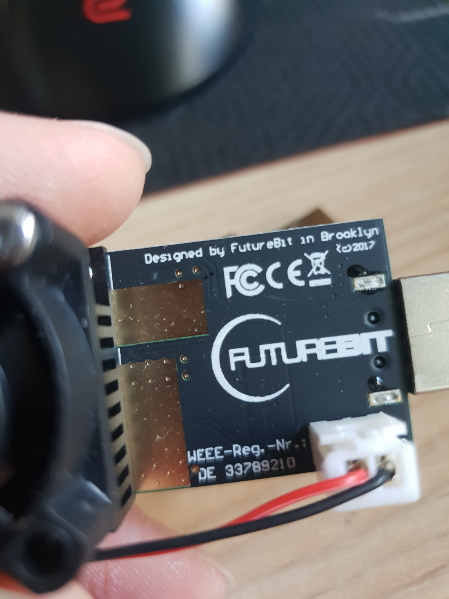
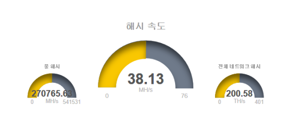

# 7회차

> 비트코인 채굴풀에 기여해보기

## 활동내용

채굴이라는 작업을 하기 위해서는 앞서 알아봤듯이 아주 많은 연산을 계속해서 수행해야 합니다. 하지만 일반 가정용 PC는 이 연산에 최적화되어있지 않고, 다양한 기능을 담을 수 있도록 설계되어 있습니다. 그렇기 때문에 일반 PC로는 최고의 효율을 내기 힘드며, 효율을 추구하기 위해 다른 기능을 모두 제거하고 연산에 최적화된 장치로 일반적으로 사용하는 그래픽카드(GPU)나 ASIC을 많이 사용합니다. 아래 사진은 직접 구매한 FutureBit 사의 USB ASIC 마이너입니다. Scrypt 해시 알고리즘에 최적화되어 있습니다.

또한 이를 병렬화하여 동시에 여러개의 ASIC을 구동할 수 있습니다. 연산 장치가 많으면 많을수록 그 성능은 거의 정비례의 관계로 증가합니다.

비트코인은 채굴 난이도가 너무 높고 블록 생성시간도 매우 길기 때문에 결과를 실시간으로 보기 힘듭니다. 그런 이유로 비트코인 대신에 MiningPoolHub 풀을 이용하여 라이트코인을 채굴해보았습니다.

## 참고자료

- [blockchain.com](http://blockchain.com/ko/explorer)
